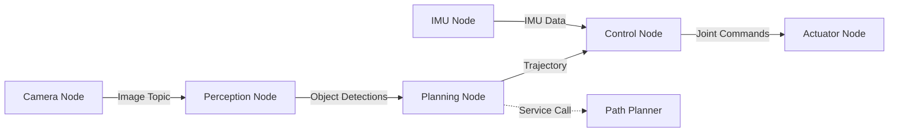

## Overview

**ROS 2** (Robot Operating System 2) is the middleware that serves as the nervous system of modern robots, including humanoids. It provides the communication infrastructure that allows sensors, actuators, perception algorithms, and control systems to work together seamlessly (Macenski et al., 2022).

Unlike its predecessor ROS 1, ROS 2 is built on **DDS** (Data Distribution Service), a real-time, industrial-grade middleware that enables:
- Real-time communication for safety-critical systems
- Multi-robot coordination
- Improved security and reliability
- Native support for embedded systems (Maruyama et al., 2016)

This chapter introduces ROS 2's architecture, core concepts (nodes, topics, services, actions), and demonstrates how to integrate Python-based AI agents with ROS 2 controllers using `rclpy`.

## Why ROS 2 for Humanoid Robotics?

Humanoid robots are complex systems with:
- **20-44 actuated joints** requiring coordinated control
- **Multiple sensors** (cameras, IMUs, force/torque sensors, LiDAR)
- **Distributed computation** (edge devices + cloud)
- **Real-time requirements** (control loops at 100-1000 Hz)

ROS 2 addresses these challenges by providing:

1. **Modular Architecture**: Separate nodes for perception, planning, and control
2. **Flexible Communication**: Publish-subscribe (topics) and request-response (services)
3. **Quality of Service (QoS)**: Configurable reliability and latency guarantees
4. **Language Support**: C++, Python, and bindings for other languages
5. **Ecosystem**: Pre-built packages for SLAM, navigation, manipulation, and more

## ROS 2 Architecture

### Core Concepts



**Key Components**:

- **Nodes**: Independent processes that perform specific tasks (e.g., camera driver, object detector)
- **Topics**: Named buses for asynchronous, many-to-many communication
- **Services**: Synchronous request-response communication
- **Actions**: Long-running tasks with feedback (e.g., "walk to location")
- **Parameters**: Configuration values that can be changed at runtime

### The ROS 2 Graph

The **ROS 2 graph** is the network of nodes and their communication channels. You can visualize it using:

```bash
ros2 run rqt_graph rqt_graph
```

For a humanoid robot, the graph might include:
- **Sensor nodes**: Camera, LiDAR, IMU, force/torque sensors
- **Perception nodes**: Object detection, SLAM, pose estimation
- **Planning nodes**: Motion planning, task planning
- **Control nodes**: Whole-body controller, joint controllers
- **Actuator nodes**: Motor drivers

## Nodes: The Building Blocks

A **node** is a single-purpose executable that communicates with other nodes. In Python, you create a node by subclassing `rclpy.node.Node`.

### Minimal Node Example

```python
import rclpy
from rclpy.node import Node

class MinimalNode(Node):
    def __init__(self):
        super().__init__('minimal_node')
        self.get_logger().info('Minimal node has been started')

def main(args=None):
    rclpy.init(args=args)
    node = MinimalNode()
    rclpy.spin(node)
    node.destroy_node()
    rclpy.shutdown()

if __name__ == '__main__':
    main()
```

**Key Methods**:
- `rclpy.init()`: Initialize ROS 2 client library
- `rclpy.spin()`: Keep the node alive and process callbacks
- `node.get_logger()`: Access the node's logger
- `rclpy.shutdown()`: Clean shutdown

## Topics: Asynchronous Communication

**Topics** enable publish-subscribe communication. Multiple nodes can publish to a topic, and multiple nodes can subscribe.

### Publisher Example

```python
from rclpy.node import Node
from std_msgs.msg import String

class PublisherNode(Node):
    def __init__(self):
        super().__init__('publisher_node')
        self.publisher = self.create_publisher(String, 'robot_status', 10)
        self.timer = self.create_timer(1.0, self.publish_status)
        self.counter = 0

    def publish_status(self):
        msg = String()
        msg.data = f'Robot operational: {self.counter}'
        self.publisher.publish(msg)
        self.get_logger().info(f'Published: {msg.data}')
        self.counter += 1
```

### Subscriber Example

```python
from rclpy.node import Node
from std_msgs.msg import String

class SubscriberNode(Node):
    def __init__(self):
        super().__init__('subscriber_node')
        self.subscription = self.create_subscription(
            String,
            'robot_status',
            self.listener_callback,
            10
        )

    def listener_callback(self, msg):
        self.get_logger().info(f'Received: {msg.data}')
```

### Common Message Types for Humanoid Robotics

| Message Type | Package | Use Case |
|--------------|---------|----------|
| `sensor_msgs/Image` | sensor_msgs | Camera images |
| `sensor_msgs/Imu` | sensor_msgs | IMU data (acceleration, gyro) |
| `sensor_msgs/JointState` | sensor_msgs | Joint positions, velocities, efforts |
| `geometry_msgs/Twist` | geometry_msgs | Linear and angular velocity commands |
| `trajectory_msgs/JointTrajectory` | trajectory_msgs | Multi-joint motion commands |

## Services: Request-Response Communication

**Services** are used for synchronous, one-to-one communication. A client sends a request and waits for a response.

### Service Server Example

```python
from rclpy.node import Node
from example_interfaces.srv import AddTwoInts

class ServiceServer(Node):
    def __init__(self):
        super().__init__('add_two_ints_server')
        self.srv = self.create_service(
            AddTwoInts,
            'add_two_ints',
            self.add_two_ints_callback
        )

    def add_two_ints_callback(self, request, response):
        response.sum = request.a + request.b
        self.get_logger().info(f'{request.a} + {request.b} = {response.sum}')
        return response
```

### Service Client Example

```python
from rclpy.node import Node
from example_interfaces.srv import AddTwoInts

class ServiceClient(Node):
    def __init__(self):
        super().__init__('add_two_ints_client')
        self.client = self.create_client(AddTwoInts, 'add_two_ints')
        while not self.client.wait_for_service(timeout_sec=1.0):
            self.get_logger().info('Service not available, waiting...')

    def send_request(self, a, b):
        request = AddTwoInts.Request()
        request.a = a
        request.b = b
        future = self.client.call_async(request)
        return future
```

**Use Cases in Humanoid Robotics**:
- Requesting a motion plan from a planner
- Querying object poses from a perception system
- Triggering calibration routines

## Actions: Long-Running Tasks with Feedback

**Actions** are for tasks that take time and provide periodic feedback (e.g., "navigate to goal").

### Action Structure

An action has three parts:
1. **Goal**: What you want to achieve
2. **Feedback**: Periodic updates during execution
3. **Result**: Final outcome

### Action Client Example

```python
from rclpy.action import ActionClient
from rclpy.node import Node
from control_msgs.action import FollowJointTrajectory

class TrajectoryActionClient(Node):
    def __init__(self):
        super().__init__('trajectory_action_client')
        self._action_client = ActionClient(
            self,
            FollowJointTrajectory,
            '/joint_trajectory_controller/follow_joint_trajectory'
        )

    def send_goal(self, trajectory):
        goal_msg = FollowJointTrajectory.Goal()
        goal_msg.trajectory = trajectory
        
        self._action_client.wait_for_server()
        self._send_goal_future = self._action_client.send_goal_async(
            goal_msg,
            feedback_callback=self.feedback_callback
        )
        self._send_goal_future.add_done_callback(self.goal_response_callback)

    def feedback_callback(self, feedback_msg):
        feedback = feedback_msg.feedback
        self.get_logger().info(f'Trajectory progress: {feedback.actual}')

    def goal_response_callback(self, future):
        goal_handle = future.result()
        if not goal_handle.accepted:
            self.get_logger().info('Goal rejected')
            return
        self.get_logger().info('Goal accepted')
```

**Use Cases**:
- Executing multi-joint trajectories
- Navigating to a target location
- Grasping an object (with force feedback)

## Integrating Python AI Agents with ROS 2

A common pattern is to use **Python for high-level AI** (perception, planning) and **C++ for low-level control** (real-time loops). The `rclpy` library bridges these layers.

### Example: Object Detection Node

```python
import rclpy
from rclpy.node import Node
from sensor_msgs.msg import Image
from vision_msgs.msg import Detection2DArray
from cv_bridge import CvBridge
import cv2
import numpy as np

class ObjectDetectorNode(Node):
    def __init__(self):
        super().__init__('object_detector')
        
        # Subscriber for camera images
        self.subscription = self.create_subscription(
            Image,
            '/camera/image_raw',
            self.image_callback,
            10
        )
        
        # Publisher for detections
        self.detection_pub = self.create_publisher(
            Detection2DArray,
            '/detections',
            10
        )
        
        self.bridge = CvBridge()
        self.get_logger().info('Object detector node started')

    def image_callback(self, msg):
        # Convert ROS Image to OpenCV format
        cv_image = self.bridge.imgmsg_to_cv2(msg, desired_encoding='bgr8')
        
        # Run object detection (placeholder for actual model)
        detections = self.detect_objects(cv_image)
        
        # Publish detections
        detection_msg = Detection2DArray()
        detection_msg.header = msg.header
        detection_msg.detections = detections
        self.detection_pub.publish(detection_msg)

    def detect_objects(self, image):
        # Placeholder: In practice, use YOLO, Faster R-CNN, etc.
        # For example, using a pre-trained model:
        # detections = self.model.predict(image)
        return []  # Return list of Detection2D messages
```

### Example: LLM-Based Task Planner

```python
import rclpy
from rclpy.node import Node
from std_msgs.msg import String
from openai import OpenAI

class LLMPlannerNode(Node):
    def __init__(self):
        super().__init__('llm_planner')
        
        self.subscription = self.create_subscription(
            String,
            '/voice_command',
            self.command_callback,
            10
        )
        
        self.action_pub = self.create_publisher(
            String,
            '/robot_actions',
            10
        )
        
        self.client = OpenAI()  # Requires OPENAI_API_KEY env var
        self.get_logger().info('LLM planner node started')

    def command_callback(self, msg):
        command = msg.data
        self.get_logger().info(f'Received command: {command}')
        
        # Use LLM to decompose command into robot actions
        actions = self.plan_actions(command)
        
        # Publish actions
        action_msg = String()
        action_msg.data = actions
        self.action_pub.publish(action_msg)

    def plan_actions(self, command):
        prompt = f"""
        You are a robot task planner. Given a natural language command,
        decompose it into a sequence of robot actions.
        
        Command: {command}
        
        Available actions: move_to, grasp, release, navigate, search
        
        Output format: action1, action2, action3
        """
        
        response = self.client.chat.completions.create(
            model="gpt-4",
            messages=[{"role": "user", "content": prompt}]
        )
        
        return response.choices[0].message.content
```

## URDF: Describing Humanoid Robots

**URDF** (Unified Robot Description Format) is an XML format for describing robot kinematics and dynamics.

### Minimal Humanoid URDF Structure

```xml
<?xml version="1.0"?>
<robot name="simple_humanoid">
  <!-- Base link (torso) -->
  <link name="torso">
    <visual>
      <geometry>
        <box size="0.3 0.2 0.5"/>
      </geometry>
    </visual>
    <inertial>
      <mass value="10.0"/>
      <inertia ixx="0.1" ixy="0.0" ixz="0.0" iyy="0.1" iyz="0.0" izz="0.1"/>
    </inertial>
  </link>

  <!-- Right shoulder joint -->
  <joint name="right_shoulder" type="revolute">
    <parent link="torso"/>
    <child link="right_upper_arm"/>
    <origin xyz="0.0 -0.15 0.2" rpy="0 0 0"/>
    <axis xyz="0 1 0"/>
    <limit lower="-1.57" upper="1.57" effort="100" velocity="1.0"/>
  </joint>

  <!-- Right upper arm link -->
  <link name="right_upper_arm">
    <visual>
      <geometry>
        <cylinder radius="0.05" length="0.3"/>
      </geometry>
    </visual>
    <inertial>
      <mass value="2.0"/>
      <inertia ixx="0.01" ixy="0.0" ixz="0.0" iyy="0.01" iyz="0.0" izz="0.01"/>
    </inertial>
  </link>

  <!-- Additional joints and links... -->
</robot>
```

**Key Elements**:
- `<link>`: Physical component with geometry, mass, and inertia
- `<joint>`: Connection between links with type (revolute, prismatic, fixed)
- `<origin>`: Position and orientation (xyz, rpy)
- `<limit>`: Joint limits (position, velocity, effort)

## Practical Example: Humanoid Joint State Publisher

```python
import rclpy
from rclpy.node import Node
from sensor_msgs.msg import JointState
import math

class HumanoidJointPublisher(Node):
    def __init__(self):
        super().__init__('humanoid_joint_publisher')
        
        self.publisher = self.create_publisher(JointState, '/joint_states', 10)
        self.timer = self.create_timer(0.01, self.publish_joint_states)  # 100 Hz
        
        # Define humanoid joints
        self.joint_names = [
            'neck_pitch', 'neck_yaw',
            'left_shoulder_pitch', 'left_shoulder_roll', 'left_elbow',
            'right_shoulder_pitch', 'right_shoulder_roll', 'right_elbow',
            'left_hip_pitch', 'left_hip_roll', 'left_knee', 'left_ankle',
            'right_hip_pitch', 'right_hip_roll', 'right_knee', 'right_ankle'
        ]
        
        self.time = 0.0

    def publish_joint_states(self):
        msg = JointState()
        msg.header.stamp = self.get_clock().now().to_msg()
        msg.name = self.joint_names
        
        # Generate sinusoidal motion for demonstration
        msg.position = [math.sin(self.time + i * 0.5) * 0.3 
                       for i in range(len(self.joint_names))]
        msg.velocity = [0.0] * len(self.joint_names)
        msg.effort = [0.0] * len(self.joint_names)
        
        self.publisher.publish(msg)
        self.time += 0.01
```

## Best Practices for ROS 2 in Humanoid Robotics

1. **Use QoS Profiles Appropriately**:
   - Sensor data: `BEST_EFFORT` (low latency, tolerates packet loss)
   - Control commands: `RELIABLE` (guaranteed delivery)

2. **Separate Concerns**:
   - Perception nodes should not do control
   - Use clear interfaces between modules

3. **Leverage Existing Packages**:
   - `ros2_control`: Hardware abstraction for actuators
   - `MoveIt 2`: Motion planning for manipulation
   - `Nav2`: Navigation stack for mobile robots

4. **Monitor Performance**:
   ```bash
   ros2 topic hz /joint_states  # Check publishing frequency
   ros2 topic bw /camera/image  # Check bandwidth usage
   ```

5. **Use Launch Files**:
   Launch files start multiple nodes with parameters:
   ```python
   from launch import LaunchDescription
   from launch_ros.actions import Node

   def generate_launch_description():
       return LaunchDescription([
           Node(
               package='humanoid_control',
               executable='joint_controller',
               name='joint_controller',
               parameters=[{'control_frequency': 100}]
           ),
           Node(
               package='humanoid_perception',
               executable='object_detector',
               name='object_detector'
           )
       ])
   ```

## Summary

ROS 2 provides the essential middleware for building complex humanoid robots. Key takeaways:

- **Nodes** are independent processes that perform specific tasks
- **Topics** enable asynchronous, many-to-many communication
- **Services** provide synchronous request-response patterns
- **Actions** handle long-running tasks with feedback
- **URDF** describes robot kinematics and dynamics
- **rclpy** integrates Python AI agents with ROS 2

In the next chapters, we'll explore how to use ROS 2 with simulation tools (Gazebo, Isaac Sim) and integrate advanced AI models for perception and control.

## References

- Macenski, S., et al. (2022). Robot Operating System 2: Design, architecture, and uses in the wild. *Science Robotics, 7*(66), eabm6074.
- Maruyama, Y., et al. (2016). Exploring the performance of ROS2. *Proceedings of the International Conference on Embedded Software (EMSOFT)*, 1-10.
- Quigley, M., et al. (2009). ROS: An open-source Robot Operating System. *ICRA Workshop on Open Source Software, 3*(3.2), 5.
- Stanford Artificial Intelligence Laboratory. (2023). ROS 2 Documentation. Retrieved from https://docs.ros.org/en/humble/
